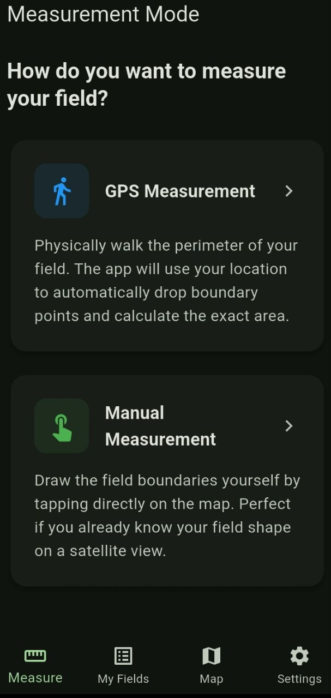
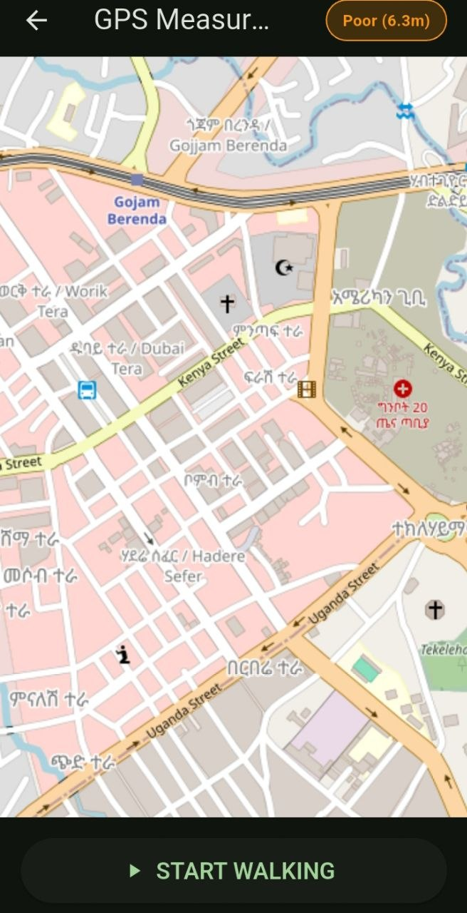
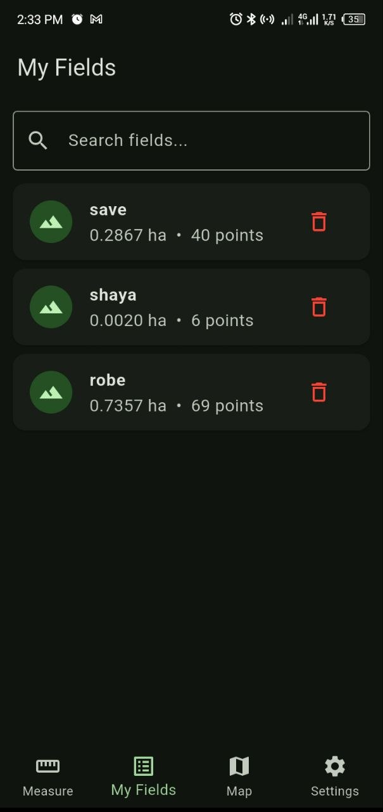
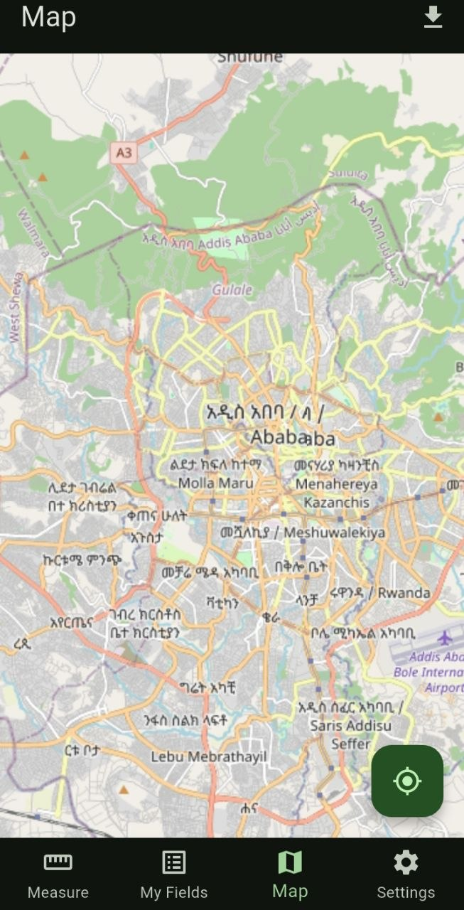
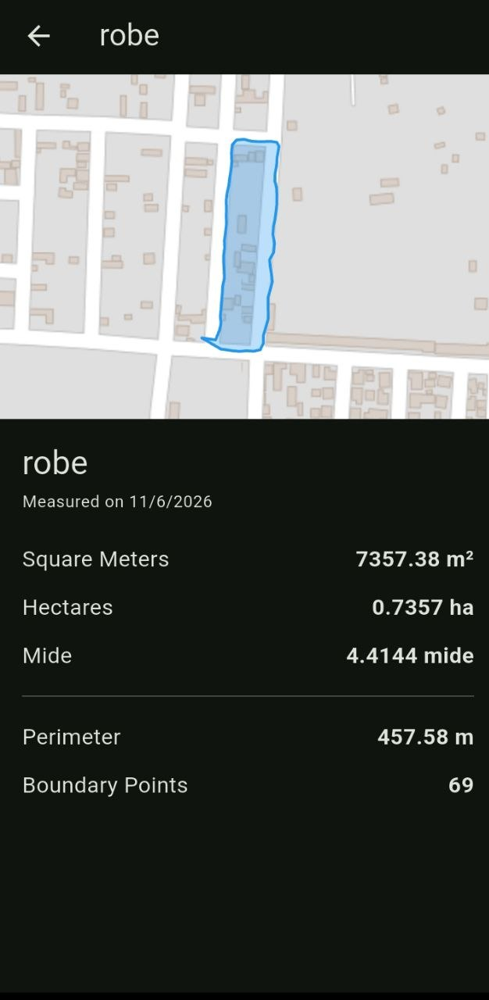
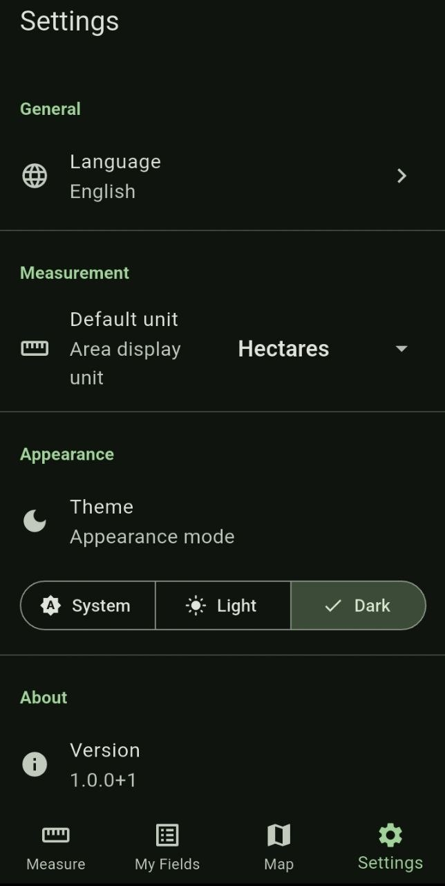
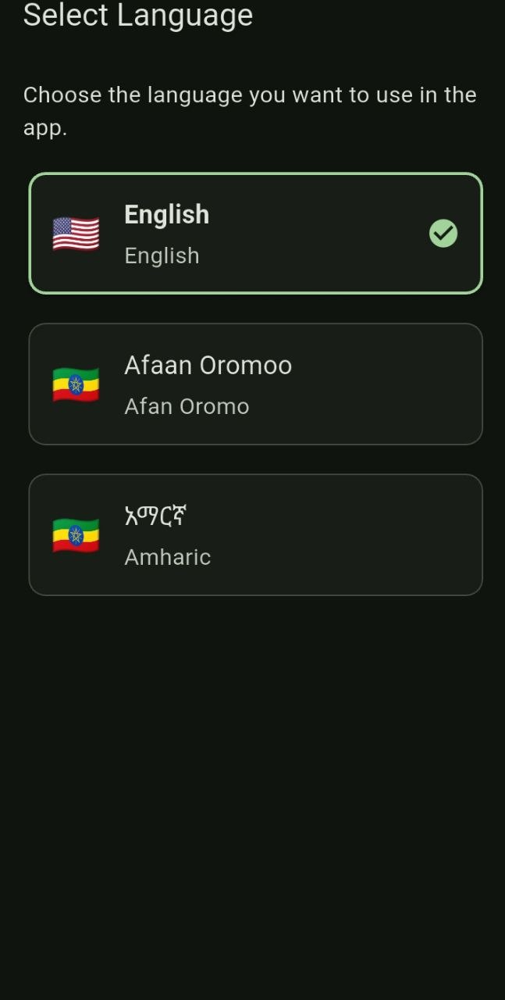
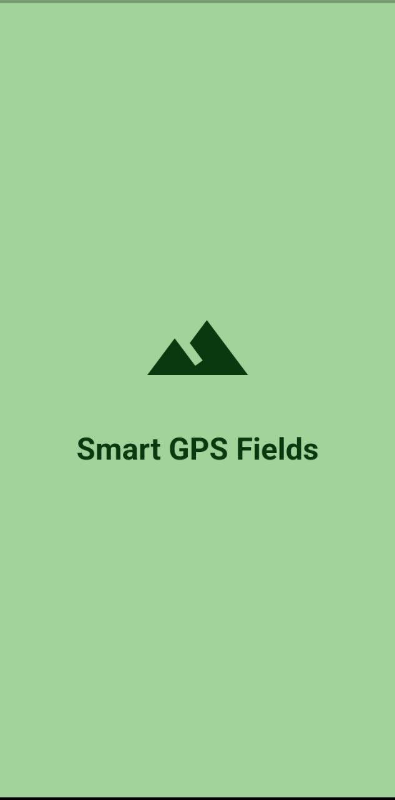

<div align="center">
  
  <h1>Smart GPS Fields Area Measure</h1>

  <p><strong>Offline-first GPS field area measurement app designed for Ethiopian smallholder farmers.</strong></p>

  <p>
    <a href="https://flutter.dev"></a>
    <a href="https://dart.dev"></a>
    <a href="https://android.com"></a>
    
    <a href="LICENSE"></a>
  </p>
  
  <p>
    <a href="#about-the-project">About</a> •
    <a href="#key-features">Features</a> •
    <a href="#screenshots">Screenshots</a> •
    <a href="#architecture">Architecture</a> •
    <a href="#getting-started">Getting Started</a> •
    <a href="#roadmap">Roadmap</a>
  </p>
  
  <p>
    <i>English | <a href="#amharic-and-afan-oromo-support">አማርኛ</a> | <a href="#amharic-and-afan-oromo-support">Afaan Oromoo</a></i>
  </p>

</div>

---

## 🌍 About The Project

Most Ethiopian smallholder farmers do not have access to professional land surveying tools, and many rural agricultural areas lack internet connectivity. Measuring farmland accurately is crucial for seed distribution, fertilizer planning, and estimating crop yields. 

**Smart GPS Fields** bridges this gap. Developed as an academic project at **Adama Science and Technology University (ASTU)** by [Gemechu Alemu](https://github.com/game-ale), this tool allows anyone with a smartphone to measure land boundaries entirely offline. 

**Partnership Opportunities:** This project is open for partnerships with NGOs, governmental bodies, and agricultural organizations to deploy the tool at scale for rural farmers in Ethiopia and beyond.

---

## ✨ Key Features

- **🚶‍♂️ GPS Measurement Mode:** Physically walk the perimeter of the field. The app tracks your real-time path and automatically drops precise boundary points.
- **👆 Manual Tap Mode:** Drop boundary points manually on an offline map. Perfect if you know your field's shape from a satellite/map view.
- **📴 100% Offline Capability:** Custom map tile caching (LRU eviction policy) allows map usage without an active internet connection.
- **🇪🇹 Localized & Culturally Aware:** Fully translated into **Amharic (አማርኛ)** and **Afaan Oromoo**, featuring local Ethiopian land measurement units like **Mide (ሚዴ)** alongside Hectares (ha) and Square Meters (m²).
- **📡 Smart GPS Tracking:** Actively monitors GPS accuracy. If the signal drops or exceeds 5 meters of error, it intelligently auto-pauses the measurement to prevent faulty data.
- **💾 Local Persistence:** Built using Hive for fast, secure on-device data storage with a soft-delete mechanism and search functionality.

---

## 📸 Screenshots

| Measurement Modes | Real-time GPS Tracking | My Fields History | Offline Maps |
| :---: | :---: | :---: | :---: |
|  |  |  |  |

| Field Detail View | Settings | Localization | Splash Screen |
| :---: | :---: | :---: | :---: |
|  |  |  |  |

---

## 🏗️ Architecture & Tech Stack

This project strictly adheres to **Clean Architecture** principles and **Domain-Driven Design (DDD)**, ensuring modularity, scalability, and high testability.

- **State Management:** `flutter_bloc`
- **Dependency Injection:** `get_it`
- **Local Database:** `hive` & `hive_flutter`
- **Navigation:** `go_router` (StatefulShellRoute for persistent bottom navigation)
- **Maps & Math:** `flutter_map` (v6) with `maps_toolkit` for spherical area computation.
- **Location:** `geolocator`
- **Theming:** Material 3 (Dynamic Color, Light/Dark Modes)

### 📂 Folder Structure
The `lib` directory is divided into `core` (shared utilities, network, GIS math) and `features` (isolated modules):
- `field_measurement`: GPS logic, area calculations, active tracking.
- `field_history`: Hive storage, search, listing, detail viewing.
- `map_view`: Offline map rendering, tile downloading, caching.
- `settings`: Localization, theming, unit preferences.
- `onboarding`: First-time user tutorial and splash screen.

---

## 🚀 Getting Started

### Prerequisites

*   Flutter SDK: `^3.11.4`
*   Dart SDK
*   Android Studio / VS Code

### Installation

1. Clone the repository:
   ```sh
   git clone https://github.com/game-ale/smart_gps_area.git
   ```
2. Navigate into the directory:
   ```sh
   cd smart_gps_area
   ```
3. Get the dependencies:
   ```sh
   flutter pub get
   ```
4. Run code generation (for localization, Hive, and freezeds):
   ```sh
   dart run build_runner build --delete-conflicting-outputs
   ```
5. Run the app:
   ```sh
   flutter run
   ```

### Useful Commands

```sh
# Run static analysis
flutter analyze

# Format Dart files
dart format --set-exit-if-changed .

# Run unit tests with coverage
flutter test --coverage

# Build release APK (Min SDK 24 / Android 7.0+)
flutter build apk --release
```

---

## 🇪🇹 Amharic and Afan Oromo Support

This app is natively built for the Ethiopian community:

*   **አማርኛ (Amharic):** መተግበሪያው ሙሉ በሙሉ በአማርኛ የተተረጎመ ሲሆን አርሶ አደሮች የራሳቸውን መሬት ስፋት ያለ በይነመረብ (Offline) በቀላሉ እንዲለኩ ያስችላል።
*   **Afaan Oromoo:** Appilikeeshiniin kun guutumaan guutuutti gara Afaan Oromootti kan hiikame yoo ta'u, qotee bultoonni haala salphaa ta'een lafa isaanii interneetii malee (Offline) akka safaran isaan gargaara.

---

## 🗺️ Roadmap & Future Enhancements

We are continuously working to improve the application. Planned features include:

- [ ] **PDF/KML Export:** Allow farmers to export and share official field measurement documents.
- [ ] **Satellite Imagery:** Add toggleable offline satellite view for manual boundary drawing.
- [ ] **Cloud Sync & Backup:** Optional secure cloud synchronization for data recovery.
- [ ] **Multi-platform:** iOS support expansion.
- [ ] **Yield Estimation:** Integrated calculator to estimate crop yields based on measured field area.

---

## 🤝 Contributing

Contributions, issues, and feature requests are welcome! Feel free to check the [issues page](https://github.com/game-ale/smart_gps_area/issues).

1. Fork the Project
2. Create your Feature Branch (`git checkout -b feature/AmazingFeature`)
3. Commit your Changes (`git commit -m 'Add some AmazingFeature'`)
4. Push to the Branch (`git push origin feature/AmazingFeature`)
5. Open a Pull Request

---

## 🎓 Acknowledgments

* Developed as a project at **Adama Science and Technology University (ASTU)**.
* OpenStreetMap contributors for map data.
* The amazing Flutter and Dart open-source community.

---

## 📄 License

Distributed under the Apache License 2.0. See [`LICENSE`](LICENSE) for more information.

<p align="center">Made with ❤️ by <a href="https://github.com/game-ale">Gemechu Alemu</a></p>
